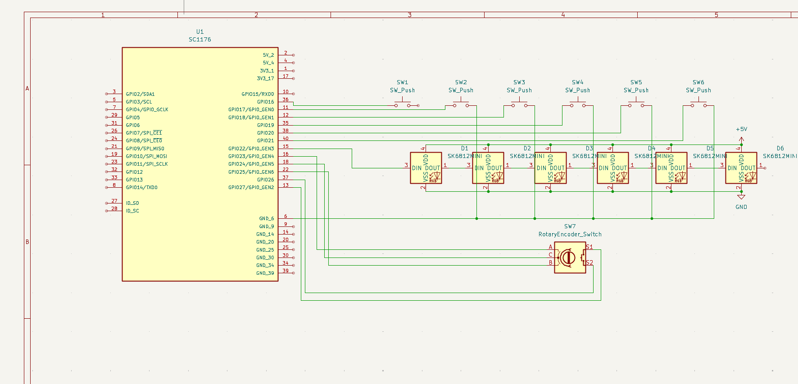
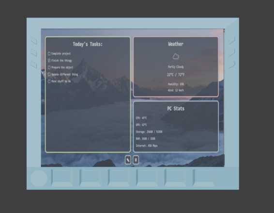
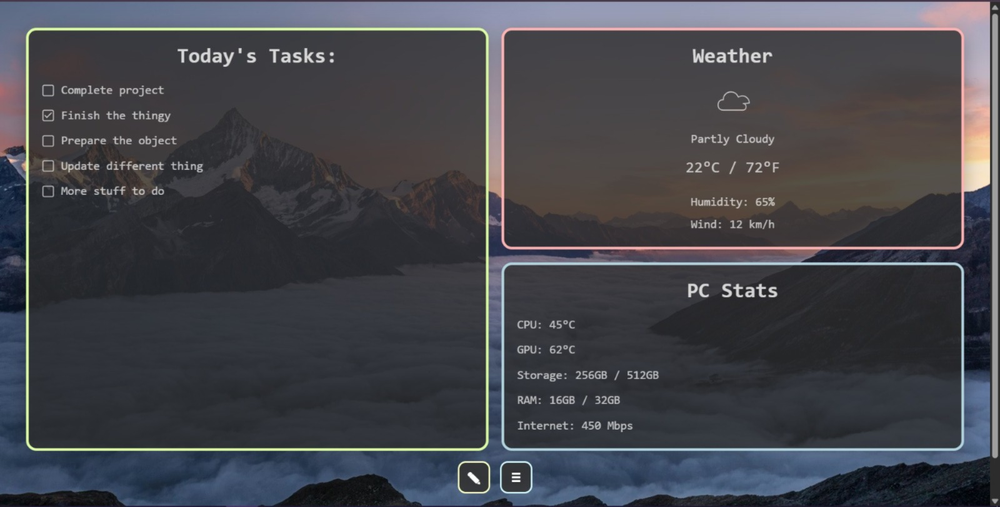
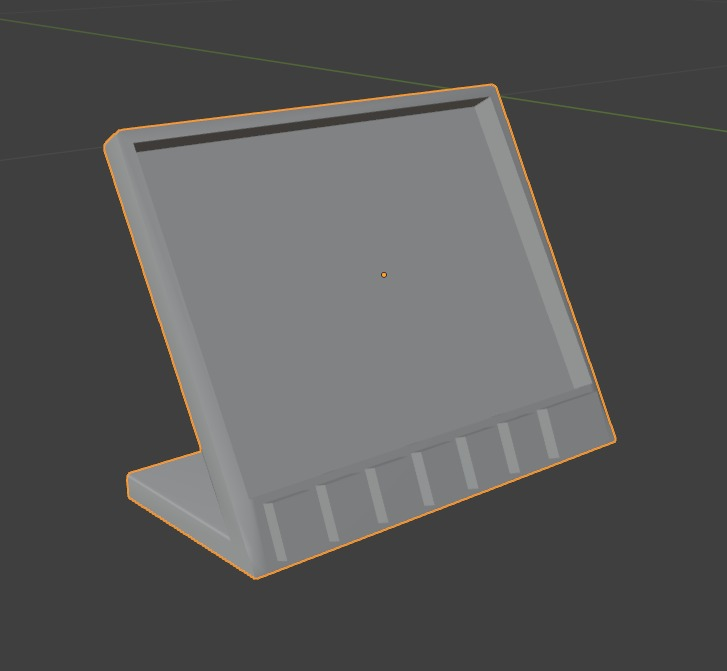

<h3>Made this with yusufumben09, forking here for my own project</h3>

<h1>Deck-like Display</h1>

A deck like display for anything, customizable for displaying anything, like a dashboard.  
<h4>Can display data from: </h4>

- pc (cpu/gpu temps, storage) 
- time 
- weather 
- data from internet like a counter for something 
- anything else that comes to your mind. 

Will be made with looks in mind and look aestethically pleasing on a desk.

Alongside the screen, it will have 6 buttons that can be configured to do specific tasks on a pc, like running an app, running a command, setting a setting, etc.. and a rotary encoder for volume on pc if connected. It will be able to run standalone for non pc related stuff.

This project will not need a PCB.

<h3>Screenshots for stuff: (SUBJECT TO CHANGE)</h3>

 

Schematic:

 

 

Ui design (heavily "inspired"):

 

Model:

BOM list:

| Part                       | Price      | Amount         | Total      | URL                                                                                                 |
|----------------------------|------------|----------------|------------|-----------------------------------------------------------------------------------------------------|
| Raspberry pi zero 2w       | 907.42TL | 1              | 907.42TL | https://www.robotistan.com/raspberry-pi-zero-2-w                                     |
| Mechanical red keyswitches | 219.61TL + 45TL shipping  | 1 (includes 6) | 264.60TL   | https://www.trendyol.com/spelt/outemu-kirmizi-mekanik-klavye-red-switch-yedek-tus-6-adet-p-54533028 |
| Waveshare 7 inch display   | 2,664.02TL | 1              | 2,664.02TL | https://www.robotistan.com/7-inch-hdmi-kapasitif-dokunmatik-lcd-coklu-sistem-1024x600-h?language=tr&h=bc209024 |
| Rotary encoder             | 95.46TL    | 1              | 95.46TL    | https://www.robotistan.com/rotary-encoder-ec11-1b-18t                                               |

Total: 3,931.50TL = 91.53 US dollars

I have access to a 3d printer and will be able to get my model printed myself.

