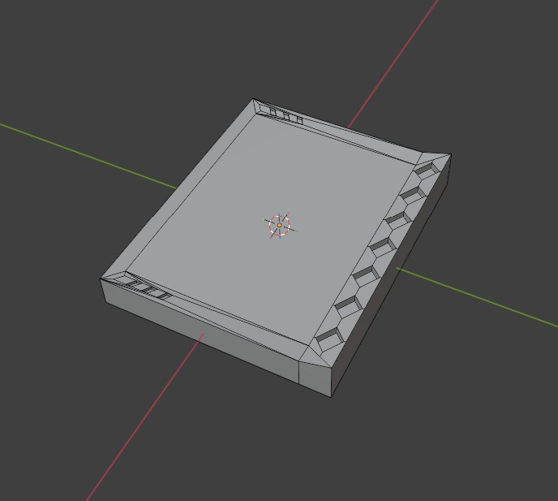

<h3>Made this with yusufumben09, forking here for my own project</h3>

<h1>Deck-like Display</h1>

A deck like display for anything, customizable for displaying anything, like a dashboard.  
<h4>Can display data from: </h4>

- pc (cpu/gpu temps, storage) 
- time 
- weather 
- data from internet like a counter for something 
- anything else that comes to your mind. 

Will be made with looks in mind and look aestethically pleasing on a desk.

Alongside the screen, it will have 6 buttons that can be configured to do specific tasks on a pc, like running an app, running a command, setting a setting, etc.. and a rotary encoder for volume on pc if connected. It will be able to run standalone for non pc related stuff.

This project will also most likely not need a PCB.

The files have not been uploaded yet, this will be removed when i do.

<h3>Screenshots for Schematic and Model: (SUBJECT TO CHANGE)</h3>

 

